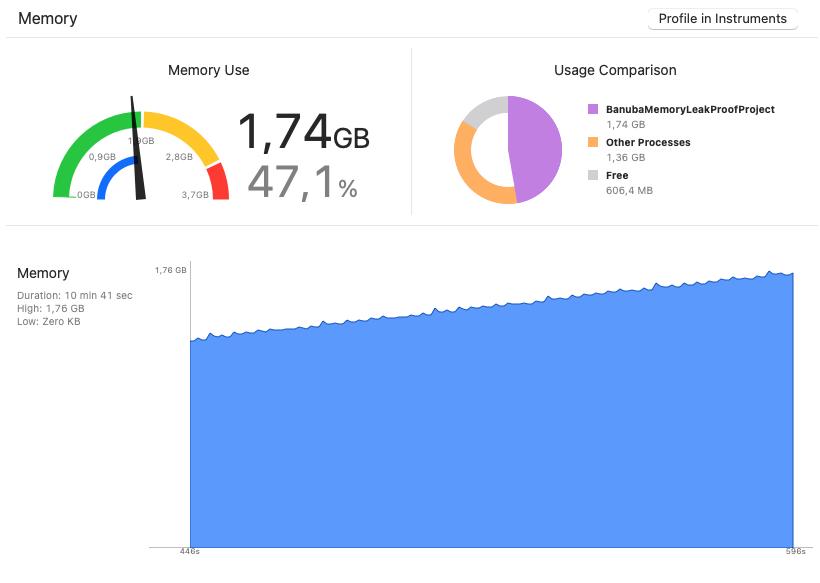

# BnbMemoryLeakProof
Project demonstates banuba memory leak on applying video effects.

1. Add BanubaEffectPlayer framework to BanubaMemoryLeakProofProject
2. Type Banuba token to banubaClientToken in ViewController.Swift
3. Launch project.
4. Wait.

You will see how memory consumption is constantly increasing. See pic. 

